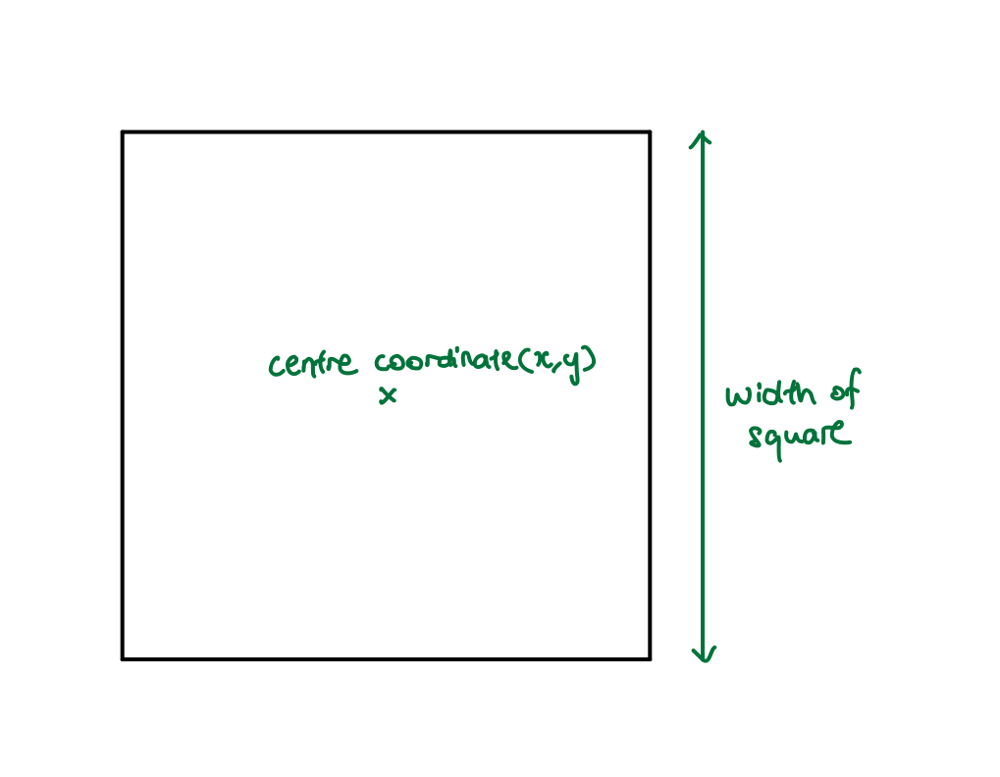

# googlePlaces

googlePlaces is a function for obtaining places of interest from the google places API. [Google places API](https://developers.google.com/places/web-service/intro) allows the retrieval of data (places of interest) from a circle of any radius with centre (x-coordinate,y-coordinate). However, Google Places API limits the search results to 60 in a given area. For example, if we use google API to search an area of 5km radius with centre (51.495227,-0.138546), google API will only return the first 60 places in the area even though there may be hundreds of places of interest in the given area.

The purpose of this script is to overcome that limit as efficiently as possible. 

### How the function works

1. The user will input:  
(a) centre coordinate (latitude & longtitude)   
(b) the width of the square area of interest  
(c) type of places interested  



2. This function then loops google places API as many time as it needs to get ALL results within the square area shown above. The following picture illustrates the searched square area with multiple google API searches (each circle represent one      parsing of the google API in that area).


3. If the number of results in any particular circle exceeds 60, the function will automatically repeat parsing the area with circles of smaller radius to ensure that no result is missed. 

4. [Optional - recommended when parsing an area of larger than 1km<sup>2</sup>] The user can also input the innerwidth argument which will split the large square area to smaller sqaure areas. This will make the programme run more efficiently. 

For example, if the user runs a search for a sqaure of area 100km<sup>2</sup>, the programme will end up using very small circles for the whole area. This is due to the high probability of a very dense area in some part of the 100km<sup>2</sup> area. If the user splits up the 100km<sup>2</sup> area into smaller squares to be searched, different radius of circles will be used which will allow a more efficient search of the 100km<sup>2</sup> area even when the desnity of places in the area is heterogenous. 


### Example Usage

```python
apiKey = "xxxxxxxxxxxxxxxxxxxxxxxx"

# the following three inputs will determine the area of search:
centre_lat = 51.495227 # centre of square
centre_long = -0.138546 
width = 3000 # width of square

type_ = 'restaurant' 

parsePlaces3(centre_lat,centre_long,width,type_)
```

```python
apiKey = "xxxxxxxxxxxxxxxxxxxxxxxx"

# the following three inputs will determine the area of search:
centre_lat = 51.495227 # centre of square
centre_long = -0.138546 
width = 3000 # width of square

innerwidth = 1000 #the width of one inner square (read 'How it works' section for more information)
type_ = 'restaurant' 

parsePlaces3(centre_lat,centre_long,width,type_,innerwidth)
```

### Usage Recommendations

Approximated optimal innerwidths to search for restaurants:
Chinatown recommended innerwidth = 500
Kensington recommended innerwidth = 600
Zone 3/residential areas recommended innerwidth = 2000

Is there a limit to maximum width of search area i can input?
No, but it is recommended that the search do not include an area so large that it includes very dense areas as well as very deserted areas. This will greatly reduce the efficiency of the function. For example, instead of searching an area of width of 30km2 that includes a very dense area (e.g. chinatown) and a less dense area (e.g. residentials) which may take hours. Split chinatown and residential areas into two areas to be searched with different innerwidths. This may increase the efficiency by a few times. 

### Limitations

1. Many results may take a long time. Every page requests (20 results) from google API is delayed by 2 seconds (a limit placed by googleAPI). Hence, to obtain 3000 locations of data may take up to an hour.

2. The function do not automatically select the most suitable innerwidth to start with. The innerwidth input is chosen intuitively and the most optimal innerwidth is dependent on the density of places in the specified location. For example, in chinatown, an innerwidth of 300 is suitable to search for restaurants but in a residential area, an innerwidth of 2000 for restaurants is suitable. If unclear, usage value recommendations are given for restaurants in London.

### Help
Contact: elvinngu@gmail.com 


